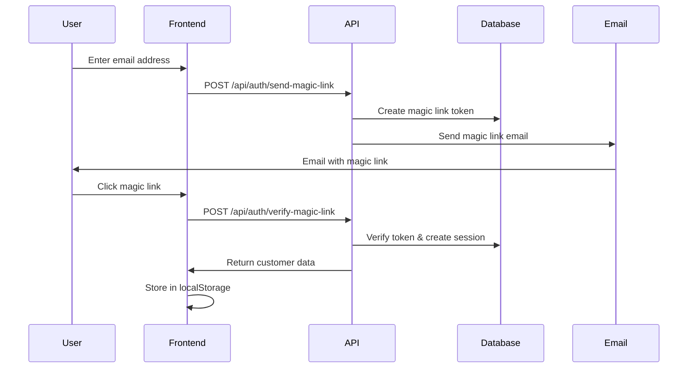

# Customer Authentication & Account Management Guide

This guide covers the complete implementation of customer authentication, account management, and order history functionality in the Pixeocommerce e-commerce storefront.

## 📋 Table of Contents

1. [Overview](#overview)
2. [Database Schema](#database-schema)
3. [Authentication Flow](#authentication-flow)
4. [API Endpoints](#api-endpoints)
5. [Frontend Components](#frontend-components)
6. [Context Providers](#context-providers)
7. [Setup Instructions](#setup-instructions)
8. [Usage Examples](#usage-examples)
9. [Troubleshooting](#troubleshooting)

## 🎯 Overview

The customer authentication system provides:
- **Magic Link Authentication**: Passwordless sign-in via email
- **Account Management**: Profile updates, address management
- **Order History**: Complete order tracking and details
- **Address Management**: Multiple shipping/billing addresses
- **Session Management**: Persistent login across browser sessions

## 🗄️ Database Schema

### 1. Customers Table
```sql
CREATE TABLE customers (
  id UUID PRIMARY KEY DEFAULT gen_random_uuid(),
  email TEXT UNIQUE NOT NULL,
  name TEXT,
  phone TEXT,
  created_at TIMESTAMP WITH TIME ZONE DEFAULT NOW(),
  updated_at TIMESTAMP WITH TIME ZONE DEFAULT NOW(),
  managed_addresses JSONB DEFAULT '[]'::jsonb
);
```

**Key Fields:**
- `id`: Unique customer identifier
- `email`: Customer's email (used for authentication)
- `name`: Customer's full name
- `phone`: Contact phone number
- `managed_addresses`: JSONB array of saved addresses

### 2. Magic Link Tokens Table
```sql
CREATE TABLE magic_link_tokens (
  id UUID PRIMARY KEY DEFAULT gen_random_uuid(),
  customer_id UUID REFERENCES customers(id) ON DELETE CASCADE,
  token TEXT UNIQUE NOT NULL,
  expires_at TIMESTAMP WITH TIME ZONE NOT NULL,
  used BOOLEAN DEFAULT FALSE,
  created_at TIMESTAMP WITH TIME ZONE DEFAULT NOW()
);
```

**Key Fields:**
- `token`: Unique token for magic link authentication
- `expires_at`: Token expiration time (24 hours)
- `used`: Prevents token reuse
- `customer_id`: Links to customer record

### 3. Customer Addresses Table
```sql
CREATE TABLE customer_addresses (
  id UUID PRIMARY KEY DEFAULT gen_random_uuid(),
  customer_id UUID REFERENCES customers(id) ON DELETE CASCADE,
  type TEXT NOT NULL CHECK (type IN ('shipping', 'billing')),
  name TEXT NOT NULL,
  address1 TEXT NOT NULL,
  address2 TEXT,
  city TEXT NOT NULL,
  state TEXT NOT NULL,
  postal_code TEXT NOT NULL,
  country TEXT NOT NULL DEFAULT 'GB',
  is_default BOOLEAN DEFAULT FALSE,
  created_at TIMESTAMP WITH TIME ZONE DEFAULT NOW(),
  updated_at TIMESTAMP WITH TIME ZONE DEFAULT NOW()
);
```

**Key Fields:**
- `type`: Address type (shipping/billing)
- `is_default`: Default address for each type
- `customer_id`: Links to customer record

### 4. Orders Table
```sql
CREATE TABLE orders (
  id UUID PRIMARY KEY DEFAULT gen_random_uuid(),
  customer_id UUID REFERENCES customers(id) ON DELETE SET NULL,
  stripe_session_id TEXT UNIQUE,
  status TEXT DEFAULT 'pending',
  total DECIMAL(10,2) NOT NULL,
  currency TEXT DEFAULT 'GBP',
  products JSONB NOT NULL,
  shipping_address JSONB,
  billing_address JSONB,
  created_at TIMESTAMP WITH TIME ZONE DEFAULT NOW(),
  updated_at TIMESTAMP WITH TIME ZONE DEFAULT NOW()
);
```

**Key Fields:**
- `customer_id`: Links to customer (nullable for guest orders)
- `products`: JSONB array of ordered products
- `shipping_address`: JSONB shipping address
- `billing_address`: JSONB billing address

## 🔐 Authentication Flow

### 1. Magic Link Sign-In Process



### 2. Session Management

- **Token Storage**: Magic link tokens stored in database with 24-hour expiration
- **Session Persistence**: Customer data stored in localStorage
- **Auto-logout**: Tokens expire after 24 hours
- **Security**: Tokens are single-use and cryptographically secure

## 🛠️ API Endpoints

### 1. Send Magic Link
**Endpoint**: `POST /api/auth/send-magic-link`

**Request Body**:
```json
{
  "email": "customer@example.com"
}
```

**Response**:
```json
{
  "success": true,
  "message": "Magic link sent to your email"
}
```

**Implementation**:
```typescript
// Creates or finds customer
// Generates secure token
// Stores token in database
// Sends magic link email (currently logged to console)
```

### 2. Verify Magic Link
**Endpoint**: `POST /api/auth/verify-magic-link`

**Request Body**:
```json
{
  "token": "secure-token-here"
}
```

**Response**:
```json
{
  "success": true,
  "customer": {
    "id": "uuid",
    "email": "customer@example.com",
    "name": "John Doe",
    "phone": "+1234567890"
  }
}
```

### 3. Customer Profile
**Endpoint**: `GET /api/customer/profile?customer_id=uuid`

**Response**:
```json
{
  "success": true,
  "customer": {
    "id": "uuid",
    "email": "customer@example.com",
    "name": "John Doe",
    "phone": "+1234567890",
    "managed_addresses": [...]
  }
}
```

### 4. Update Profile
**Endpoint**: `PUT /api/customer/profile`

**Request Body**:
```json
{
  "customer_id": "uuid",
  "name": "John Doe",
  "phone": "+1234567890"
}
```

### 5. Address Management
**Endpoint**: `POST /api/customer/addresses`

**Request Body**:
```json
{
  "customer_id": "uuid",
  "type": "shipping",
  "name": "John Doe",
  "address1": "123 Main St",
  "city": "London",
  "state": "England",
  "postal_code": "SW1A 1AA",
  "country": "GB",
  "is_default": true
}
```

### 6. Order History
**Endpoint**: `GET /api/customer/orders?customer_id=uuid`

**Response**:
```json
{
  "success": true,
  "orders": [
    {
      "id": "uuid",
      "status": "completed",
      "total": 99.99,
      "created_at": "2024-01-15T10:30:00Z",
      "products": [...]
    }
  ]
}
```

## 🎨 Frontend Components

### 1. CustomerAuthContext
**File**: `contexts/CustomerAuthContext.tsx`

**Features**:
- Customer state management
- Authentication status tracking
- Address management
- Session persistence

**Key Methods**:
```typescript
const {
  customer,
  isAuthenticated,
  signIn,
  signOut,
  refreshCustomerData,
  addAddress,
  updateAddress,
  deleteAddress
} = useCustomerAuth();
```

### 2. Account Pages

#### Profile Page (`app/account/profile/page.tsx`)
- Update name and phone number
- View account information
- Manage account settings

#### Addresses Page (`app/account/addresses/page.tsx`)
- Add new addresses
- Edit existing addresses
- Set default addresses
- Delete addresses

#### Orders Page (`app/account/orders/page.tsx`)
- View order history
- Order details and status
- Product information
- Order tracking

### 3. Authentication Components

#### Sign-In Modal
- Email input
- Magic link sending
- Loading states
- Error handling

#### Account Navigation
- User icon in header
- Dropdown menu
- Sign-in/sign-out options

## 🔧 Context Providers

### CustomerAuthProvider
**File**: `contexts/CustomerAuthContext.tsx`

**State Management**:
```typescript
interface CustomerAuthContextType {
  customer: StoreCustomer | null;
  isAuthenticated: boolean;
  isLoading: boolean;
  signIn: (email: string) => Promise<void>;
  signOut: () => void;
  refreshCustomerData: () => Promise<void>;
  addAddress: (address: AddressInput) => Promise<void>;
  updateAddress: (id: string, address: AddressInput) => Promise<void>;
  deleteAddress: (id: string) => Promise<void>;
}
```

**Key Features**:
- Automatic session restoration
- Address management
- Customer data synchronization
- Error handling

## ⚙️ Setup Instructions

### 1. Database Setup

Run the following SQL scripts in your Supabase SQL editor:

```sql
-- Create customers table
CREATE TABLE customers (
  id UUID PRIMARY KEY DEFAULT gen_random_uuid(),
  email TEXT UNIQUE NOT NULL,
  name TEXT,
  phone TEXT,
  created_at TIMESTAMP WITH TIME ZONE DEFAULT NOW(),
  updated_at TIMESTAMP WITH TIME ZONE DEFAULT NOW(),
  managed_addresses JSONB DEFAULT '[]'::jsonb
);

-- Create magic link tokens table
CREATE TABLE magic_link_tokens (
  id UUID PRIMARY KEY DEFAULT gen_random_uuid(),
  customer_id UUID REFERENCES customers(id) ON DELETE CASCADE,
  token TEXT UNIQUE NOT NULL,
  expires_at TIMESTAMP WITH TIME ZONE NOT NULL,
  used BOOLEAN DEFAULT FALSE,
  created_at TIMESTAMP WITH TIME ZONE DEFAULT NOW()
);

-- Create customer addresses table
CREATE TABLE customer_addresses (
  id UUID PRIMARY KEY DEFAULT gen_random_uuid(),
  customer_id UUID REFERENCES customers(id) ON DELETE CASCADE,
  type TEXT NOT NULL CHECK (type IN ('shipping', 'billing')),
  name TEXT NOT NULL,
  address1 TEXT NOT NULL,
  address2 TEXT,
  city TEXT NOT NULL,
  state TEXT NOT NULL,
  postal_code TEXT NOT NULL,
  country TEXT NOT NULL DEFAULT 'GB',
  is_default BOOLEAN DEFAULT FALSE,
  created_at TIMESTAMP WITH TIME ZONE DEFAULT NOW(),
  updated_at TIMESTAMP WITH TIME ZONE DEFAULT NOW()
);

-- Create indexes
CREATE INDEX idx_magic_link_tokens_token ON magic_link_tokens(token);
CREATE INDEX idx_magic_link_tokens_customer_id ON magic_link_tokens(customer_id);
CREATE INDEX idx_customer_addresses_customer_id ON customer_addresses(customer_id);
CREATE INDEX idx_orders_customer_id ON orders(customer_id);
```

### 2. Row Level Security (RLS)

```sql
-- Enable RLS
ALTER TABLE customers ENABLE ROW LEVEL SECURITY;
ALTER TABLE magic_link_tokens ENABLE ROW LEVEL SECURITY;
ALTER TABLE customer_addresses ENABLE ROW LEVEL SECURITY;

-- Allow anonymous customer creation
CREATE POLICY "Allow anonymous customer creation" ON customers
  FOR INSERT WITH CHECK (true);

-- Allow customers to read their own data
CREATE POLICY "Customers can read own data" ON customers
  FOR SELECT USING (email = auth.jwt() ->> 'email');

-- Allow customers to update their own data
CREATE POLICY "Customers can update own data" ON customers
  FOR UPDATE USING (email = auth.jwt() ->> 'email');

-- Allow customers to access their own tokens
CREATE POLICY "Customers can access their own magic link tokens" ON magic_link_tokens
  FOR ALL USING (customer_id IN (
    SELECT id FROM customers WHERE email = auth.jwt() ->> 'email'
  ));

-- Allow customers to access their own addresses
CREATE POLICY "Customers can access their own addresses" ON customer_addresses
  FOR ALL USING (customer_id IN (
    SELECT id FROM customers WHERE email = auth.jwt() ->> 'email'
  ));
```

### 3. Environment Variables

```env
# Supabase Configuration
NEXT_PUBLIC_SUPABASE_URL=your_supabase_url
NEXT_PUBLIC_SUPABASE_ANON_KEY=your_supabase_anon_key
SUPABASE_SERVICE_ROLE_KEY=your_service_role_key

# Site Configuration
NEXT_PUBLIC_SITE_URL=https://aura.pixeocommerce.com
```

### 4. Email Configuration

Currently, magic links are logged to console. For production, implement email sending:

```typescript
// In send-magic-link route
const magicLink = `${process.env.NEXT_PUBLIC_SITE_URL}/auth/verify?token=${token}`;

// TODO: Send email with magic link
// Example: SendGrid, Resend, or Supabase Edge Functions
```

## 📱 Usage Examples

### 1. Customer Sign-In

```typescript
import { useCustomerAuth } from '@/contexts/CustomerAuthContext';

function SignInForm() {
  const { signIn, isLoading } = useCustomerAuth();
  
  const handleSubmit = async (email: string) => {
    try {
      await signIn(email);
      // Magic link sent
    } catch (error) {
      // Handle error
    }
  };
}
```

### 2. Address Management

```typescript
const { addAddress, updateAddress, deleteAddress } = useCustomerAuth();

// Add new address
await addAddress({
  type: 'shipping',
  name: 'John Doe',
  address1: '123 Main St',
  city: 'London',
  state: 'England',
  postal_code: 'SW1A 1AA',
  country: 'GB',
  is_default: true
});

// Update address
await updateAddress(addressId, updatedAddressData);

// Delete address
await deleteAddress(addressId);
```

### 3. Order History

```typescript
const { customer } = useCustomerAuth();

// Orders are automatically linked to customer_id
// View in /account/orders page
```

## 🔍 Troubleshooting

### Common Issues

1. **RLS Policy Errors**
   - Run the `fix-rls-policies.sql` file in Supabase SQL editor
   - Ensure service role key is used for API operations

2. **Magic Link Not Working**
   - Check email configuration
   - Verify token expiration (24 hours)
   - Check console logs for magic link URLs

3. **Address Management Issues**
   - Ensure customer is authenticated
   - Check address validation
   - Verify database permissions

4. **Order History Not Showing**
   - Check customer_id linking in orders table
   - Verify order creation process
   - Check API endpoint responses

### Debug Information

Enable debug logging by checking browser console for:
- `[AUTH]` prefixed logs for authentication
- `[CUSTOMER]` prefixed logs for customer operations
- `[ADDRESS]` prefixed logs for address management

### Database Queries for Debugging

```sql
-- Check customer records
SELECT * FROM customers WHERE email = 'customer@example.com';

-- Check magic link tokens
SELECT * FROM magic_link_tokens WHERE customer_id = 'customer-uuid';

-- Check customer addresses
SELECT * FROM customer_addresses WHERE customer_id = 'customer-uuid';

-- Check customer orders
SELECT * FROM orders WHERE customer_id = 'customer-uuid';
```

## 🚀 Production Considerations

1. **Email Service**: Implement proper email sending service
2. **Security**: Use HTTPS for all magic links
3. **Rate Limiting**: Implement rate limiting for magic link requests
4. **Monitoring**: Add error tracking and monitoring
5. **Backup**: Regular database backups
6. **Performance**: Index optimization for large datasets

## 📚 Related Files

- `contexts/CustomerAuthContext.tsx` - Main authentication context
- `app/api/auth/send-magic-link/route.ts` - Magic link sending
- `app/api/auth/verify-magic-link/route.ts` - Magic link verification
- `app/api/customer/profile/route.ts` - Profile management
- `app/api/customer/addresses/route.ts` - Address management
- `app/api/customer/orders/route.ts` - Order history
- `app/account/` - Account management pages
- `fix-rls-policies.sql` - Database security policies
