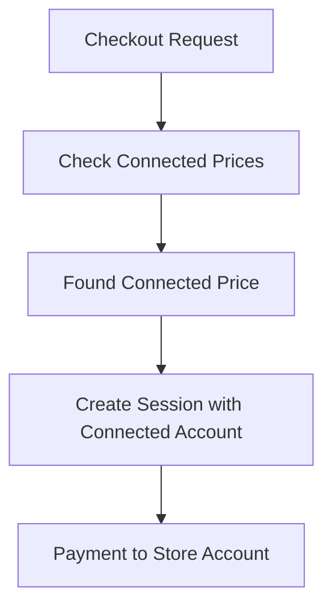
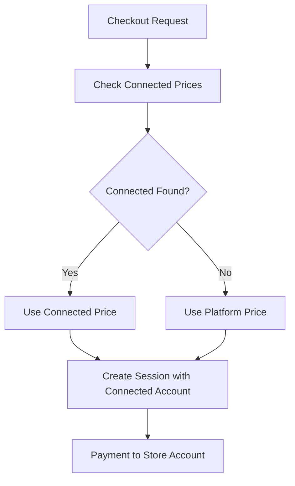
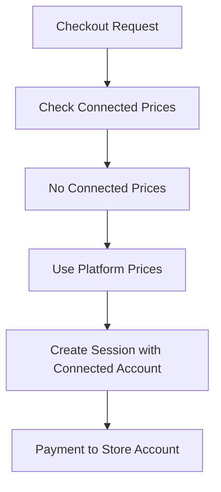

# Pixeocommerce Price ID System Documentation

## Overview

This document explains the dual price ID system used in Pixeocommerce websites, which supports both Connected Account prices (preferred) and Platform prices (fallback) to enable flexible multi-tenant Stripe Connect integration.

---

## Price ID Architecture

### Dual Price System

Pixeocommerce uses a **Connected Account First, Platform Fallback** pricing model:

1. **Connected Account Prices** (Primary) - Store-specific Stripe Connect account
2. **Platform Prices** (Fallback) - Main platform Stripe account

This allows stores to have their own Stripe Connect accounts while maintaining platform-level price management as backup.

---

## Database Schema

### Products Table Price Fields

```sql
-- Main product price fields
stripe_price_id VARCHAR(255),              -- Platform account price ID
connected_stripe_price_id VARCHAR(255),    -- Connected account price ID

-- Variant price fields (JSONB arrays)
stripe_products JSONB,                     -- Platform account variant prices
connected_stripe_products JSONB            -- Connected account variant prices
```

### Variant Price Structure

**Platform Variants** (`stripe_products`):
```json
[
  {
    "variant_id": "uuid-string",
    "stripe_price_id": "price_platform123",
    "stripe_product_id": "prod_platform123"
  }
]
```

**Connected Account Variants** (`connected_stripe_products`):
```json
[
  {
    "variant_id": "uuid-string", 
    "connected_stripe_price_id": "price_connected123",
    "connected_stripe_product_id": "prod_connected123"
  }
]
```

---

## Price Resolution Logic

### 1. Main Product Pricing

**Priority Order:**
```typescript
// Line 214 in checkout API
priceId = product.connected_stripe_price_id || product.stripe_price_id;
```

1. **First**: `connected_stripe_price_id` (Connected Account)
2. **Fallback**: `stripe_price_id` (Platform Account)

### 2. Variant Product Pricing

**Priority Order:**
```typescript
// Variant pricing logic (Lines 184-208)

// 1. Try connected account variants first
if (product.connected_stripe_products?.length > 0) {
  const connectedVariant = product.connected_stripe_products.find(
    v => v.variant_id === item.variant_id
  );
  if (connectedVariant?.connected_stripe_price_id) {
    priceId = connectedVariant.connected_stripe_price_id;
  }
}

// 2. Fallback to platform variants
if (!priceId && product.stripe_products?.length > 0) {
  const platformVariant = product.stripe_products.find(
    v => v.variant_id === item.variant_id
  );
  if (platformVariant?.stripe_price_id) {
    priceId = platformVariant.stripe_price_id;
  }
}
```

**For Variants:**
1. **First**: `connected_stripe_products[].connected_stripe_price_id`
2. **Fallback**: `stripe_products[].stripe_price_id`

### 3. Final Fallback

If no price ID is found in either system:
```typescript
if (!priceId) {
  return NextResponse.json({ 
    error: 'Price not found for item' 
  }, { status: 400 });
}
```

---

## Checkout Session Context

### Connected Account Integration

**All checkout sessions are created in Connected Account context:**

```typescript
// Line 261 in checkout API
const session = await stripe.checkout.sessions.create({
  // ... session configuration
}, {
  stripeAccount: store.stripe_account_id,  // CRITICAL: Connected Account
});
```

**Key Points:**
- ✅ Payments go to the store's connected account
- ✅ Platform can take application fees
- ✅ Store maintains payment autonomy
- ✅ Compatible with both price types

---

## Implementation Requirements

### 1. Store Configuration

**Required in `stores` table:**
```sql
-- Store must have connected Stripe account
UPDATE stores 
SET stripe_account_id = 'acct_connected_account_id' 
WHERE id = 'store-uuid';
```

### 2. Product Price Setup

**Option A: Connected Account Only (Recommended)**
```sql
UPDATE products 
SET connected_stripe_price_id = 'price_connected123'
WHERE id = 'product-uuid';
```

**Option B: Platform Fallback**
```sql
UPDATE products 
SET 
  connected_stripe_price_id = 'price_connected123',  -- Primary
  stripe_price_id = 'price_platform123'             -- Fallback
WHERE id = 'product-uuid';
```

**Option C: Platform Only (Not Recommended)**
```sql
UPDATE products 
SET stripe_price_id = 'price_platform123'
WHERE id = 'product-uuid';
```

### 3. Variant Price Setup

**Connected Account Variants:**
```sql
UPDATE products 
SET connected_stripe_products = '[
  {
    "variant_id": "variant-uuid-1",
    "connected_stripe_price_id": "price_connected456",
    "connected_stripe_product_id": "prod_connected456"
  },
  {
    "variant_id": "variant-uuid-2", 
    "connected_stripe_price_id": "price_connected789",
    "connected_stripe_product_id": "prod_connected789"
  }
]'::jsonb
WHERE id = 'product-uuid';
```

---

## Configuration Scenarios

### Scenario 1: Full Connected Account Setup (Recommended)

**Store:** Has `stripe_account_id`
**Products:** Have `connected_stripe_price_id`
**Variants:** Use `connected_stripe_products`



**Benefits:**
- Direct payments to store
- Full store autonomy
- Platform fee capability
- Best performance

### Scenario 2: Hybrid Setup (Fallback Protection)

**Store:** Has `stripe_account_id`
**Products:** Have both price types
**Variants:** Have both price arrays



**Benefits:**
- Fallback protection
- Migration flexibility
- Backwards compatibility

### Scenario 3: Platform Only (Limited)

**Store:** Has `stripe_account_id`
**Products:** Only have `stripe_price_id`
**Variants:** Only use `stripe_products`



**Limitations:**
- Price management complexity
- Potential sync issues
- Not optimal for store autonomy

---

## Setup Guide for New Stores

### Step 1: Create Stripe Connect Account

```bash
# Create connected account via Stripe API or Dashboard
curl -X POST https://api.stripe.com/v1/accounts \
  -H "Authorization: Bearer sk_..." \
  -d "type=express" \
  -d "country=US"
```

### Step 2: Store Configuration

```sql
-- Add connected account to store
UPDATE stores 
SET 
  stripe_account_id = 'acct_1234567890',
  currency = 'usd'
WHERE id = 'your-store-id';
```

### Step 3: Create Connected Account Products

```javascript
// Create product in connected account
const product = await stripe.products.create({
  name: "Product Name",
  description: "Product description",
  metadata: {
    supabase_product_id: "product-uuid"
  }
}, {
  stripeAccount: 'acct_connected_account_id'
});

// Create price in connected account
const price = await stripe.prices.create({
  product: product.id,
  unit_amount: 2999, // $29.99
  currency: 'usd',
}, {
  stripeAccount: 'acct_connected_account_id'
});
```

### Step 4: Update Product Database

```sql
-- Update product with connected price
UPDATE products 
SET connected_stripe_price_id = 'price_connected123'
WHERE id = 'product-uuid';
```

### Step 5: Test Checkout

```javascript
// Test checkout with debug logging
const response = await fetch('/api/create-product-checkout', {
  method: 'POST',
  headers: { 'Content-Type': 'application/json' },
  body: JSON.stringify({
    items: [{ product_id: 'product-uuid', quantity: 1 }],
    storeId: 'store-uuid',
    storeName: 'Test Store'
  })
});

const result = await response.json();
console.log('Checkout result:', result);
```

---

## Debugging Price Issues

### Common Price-Related Errors

| Error | Cause | Solution |
|-------|--------|----------|
| "Price not found for item" | No price ID in either system | Add `connected_stripe_price_id` or `stripe_price_id` |
| "Store is not connected to Stripe" | Missing `stripe_account_id` | Add connected account to store |
| "Invalid price" | Price ID doesn't exist in Stripe | Verify price exists in correct account |
| "No such price" | Wrong account context | Check if price belongs to connected account |

### Debug Queries

**Check Product Pricing:**
```sql
SELECT 
  id,
  name,
  stripe_price_id,
  connected_stripe_price_id,
  CASE 
    WHEN connected_stripe_price_id IS NOT NULL THEN 'Connected'
    WHEN stripe_price_id IS NOT NULL THEN 'Platform'
    ELSE 'No Price'
  END as price_type
FROM products 
WHERE store_id = 'your-store-id';
```

**Check Variant Pricing:**
```sql
SELECT 
  id,
  name,
  jsonb_array_length(COALESCE(connected_stripe_products, '[]'::jsonb)) as connected_variants,
  jsonb_array_length(COALESCE(stripe_products, '[]'::jsonb)) as platform_variants
FROM products 
WHERE store_id = 'your-store-id' 
AND variants IS NOT NULL;
```

**Check Store Configuration:**
```sql
SELECT 
  id,
  name,
  stripe_account_id,
  CASE 
    WHEN stripe_account_id IS NOT NULL THEN 'Connected'
    ELSE 'Not Connected'
  END as stripe_status
FROM stores 
WHERE id = 'your-store-id';
```

### Debug API Response

```javascript
// Add to checkout API for debugging
console.log('[CHECKOUT] Price resolution:', {
  product_id: item.product_id,
  has_connected_price: !!product.connected_stripe_price_id,
  has_platform_price: !!product.stripe_price_id,
  selected_price: priceId,
  price_source: product.connected_stripe_price_id ? 'connected' : 'platform'
});
```

---

## Migration Strategies

### From Platform to Connected Account

1. **Create connected account products/prices**
2. **Update database with connected price IDs**
3. **Keep platform prices as fallback**
4. **Test thoroughly**
5. **Remove platform prices (optional)**

### Bulk Migration Script

```javascript
async function migrateToConnectedPrices() {
  const products = await supabase
    .from('products')
    .select('*')
    .eq('store_id', 'store-id')
    .is('connected_stripe_price_id', null);

  for (const product of products.data) {
    // Create connected account price
    const connectedPrice = await stripe.prices.create({
      product: await createConnectedProduct(product),
      unit_amount: Math.round(product.price * 100),
      currency: 'usd',
    }, {
      stripeAccount: 'acct_connected_account'
    });

    // Update database
    await supabase
      .from('products')
      .update({ connected_stripe_price_id: connectedPrice.id })
      .eq('id', product.id);
  }
}
```

---

## Best Practices

### 1. Price Management

✅ **Use connected account prices for new products**
✅ **Keep platform prices as fallback during migration**
✅ **Sync price changes between systems if using both**
✅ **Regular audits of price consistency**

### 2. Error Handling

✅ **Always check for price existence before checkout**
✅ **Provide clear error messages for missing prices**
✅ **Log price resolution for debugging**
✅ **Implement fallback strategies**

### 3. Performance

✅ **Cache frequently accessed price data**
✅ **Minimize database queries in checkout flow**
✅ **Use database indexes on price ID fields**
✅ **Optimize variant price lookups**

### 4. Security

✅ **Validate price IDs server-side only**
✅ **Never expose internal price logic to frontend**
✅ **Use proper Stripe account contexts**
✅ **Implement proper error boundaries**

---

## Monitoring and Analytics

### Key Metrics

1. **Price Resolution Success Rate**
2. **Connected vs Platform Price Usage**
3. **Failed Checkout Due to Missing Prices**
4. **Store-level Price Configuration Status**

### Monitoring Queries

```sql
-- Price configuration audit
SELECT 
  s.name as store_name,
  COUNT(p.id) as total_products,
  COUNT(p.connected_stripe_price_id) as connected_prices,
  COUNT(p.stripe_price_id) as platform_prices,
  ROUND(
    COUNT(p.connected_stripe_price_id) * 100.0 / COUNT(p.id), 
    2
  ) as connected_percentage
FROM stores s
LEFT JOIN products p ON s.id = p.store_id
GROUP BY s.id, s.name
ORDER BY connected_percentage DESC;
```

---

This price ID system provides flexibility, reliability, and scalability for multi-tenant Stripe Connect ecommerce platforms while maintaining clear fallback strategies and easy debugging capabilities.
