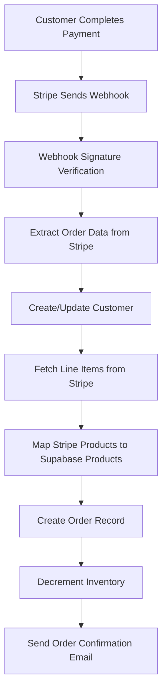

# Pixeocommerce Webhook & Inventory System Documentation

## Overview

This document explains how the Pixeocommerce webhook system processes completed orders, stores them in the Supabase database, and automatically decrements inventory quantities for both simple products and variants.

---

## Webhook System Architecture

### Complete Order Processing Flow



---

## Webhook Implementation Analysis

### 1. Webhook Endpoint Configuration

**Location**: `/api/stripe/webhook/route.ts`

**Required Environment Variables:**
```bash
NEXT_PUBLIC_SUPABASE_URL=https://your-project.supabase.co
SUPABASE_SERVICE_ROLE_KEY=your_service_role_key
STRIPE_WEBHOOK_SECRET=whsec_your_webhook_secret
```

### 2. Webhook Event Processing

**Trigger Event**: `checkout.session.completed`

```typescript
// Webhook signature verification (Lines 14-23)
let event;
try {
  event = stripe.webhooks.constructEvent(
    body,
    sig!,
    process.env.STRIPE_WEBHOOK_SECRET!
  );
} catch (err) {
  return NextResponse.json({ 
    error: 'Webhook signature verification failed.' 
  }, { status: 400 });
}
```

**Critical Points:**
- ✅ Webhook signature MUST be verified for security
- ✅ Uses `STRIPE_WEBHOOK_SECRET` environment variable
- ✅ Handles both platform and connected account webhooks

---

## Order Processing Workflow

### Step 1: Customer Management (Lines 35-47)

```typescript
// 1. Upsert customer
const { data: customerData } = await supabase
  .from('customers')
  .upsert([{
    store_id: session.metadata?.store_id,
    email: session.customer_details?.email,
    name: session.customer_details?.name,
    address: session.customer_details?.address || null,
  }])
  .select('id')
  .single();
```

**Key Features:**
- ✅ **Upsert logic** - Creates new customer or updates existing
- ✅ **Store isolation** - Customer linked to specific store
- ✅ **Address handling** - Stores shipping address from Stripe

### Step 2: Product Data Extraction (Lines 49-120)

**Fetch Line Items from Stripe:**
```typescript
const lineItems = await stripe.checkout.sessions.listLineItems(
  session.id,
  { expand: ['data.price.product'] },
  connectedAccountId ? { stripeAccount: connectedAccountId } : undefined
);
```

**Product ID Mapping Logic:**
```typescript
// Extract Supabase product ID from Stripe metadata
if (stripeProduct.metadata?.supabase_product_id) {
  supabaseProductId = stripeProduct.metadata.supabase_product_id;
} else if (stripeProduct.metadata?.product_id) {
  supabaseProductId = stripeProduct.metadata.product_id;
}

// Extract variant ID if present
if (stripeProduct.metadata?.variant_id) {
  variantId = stripeProduct.metadata.variant_id;
}
```

**Critical Requirements:**
- ✅ Stripe products MUST have `supabase_product_id` or `product_id` in metadata
- ✅ Variant products MUST have `variant_id` in metadata
- ✅ Handles both connected account and platform contexts

### Step 3: Order Creation (Lines 123-136)

```typescript
// 2. Insert order (with products array)
const { data: orderData } = await supabase
  .from('orders')
  .insert([{
    store_id: session.metadata?.store_id,
    customer_id: customerData?.id,
    status: 'paid',
    total: session.amount_total ? session.amount_total / 100 : 0,
    stripe_session_id: session.id,
    products: products, // Array of ordered products
  }])
  .select('id')
  .single();
```

**Order Record Structure:**
- `store_id` - Links order to specific store
- `customer_id` - References customer record
- `status` - Set to 'paid' after successful payment
- `total` - Converted from cents to dollars
- `stripe_session_id` - Reference to Stripe session
- `products` - JSONB array containing all ordered items

---

## Inventory Management System

### Dual Inventory Types

The system handles two types of inventory:

1. **Simple Products** - Single stock field
2. **Variant Products** - Stock per variant in JSONB array

### Simple Product Stock Deduction (Lines 185-213)

```typescript
// Decrement stock for simple product
const { data: currentProduct, error: fetchError } = await supabase
  .from('products')
  .select('stock')
  .eq('id', item.product_id)
  .single();

const currentStock = currentProduct?.stock || 0;
const newStock = Math.max(0, currentStock - (item.quantity || 0));

const { error: updateError } = await supabase
  .from('products')
  .update({ stock: newStock })
  .eq('id', item.product_id);
```

**Process:**
1. Fetch current stock from `products.stock`
2. Calculate new stock (minimum 0)
3. Update `products.stock` field

### Variant Product Stock Deduction (Lines 148-183)

```typescript
// Decrement stock for variant
const { data: product, error: fetchError } = await supabase
  .from('products')
  .select('id, variants')
  .eq('id', item.product_id)
  .single();

const updatedVariants = product.variants.map((variant: any) => {
  if (variant.id === item.variant_id) {
    const newStock = Math.max(0, (variant.stock || 0) - (item.quantity || 0));
    return { ...variant, stock: newStock };
  }
  return variant;
});

const { error: updateError } = await supabase
  .from('products')
  .update({ variants: updatedVariants })
  .eq('id', item.product_id);
```

**Process:**
1. Fetch entire `variants` JSONB array
2. Find specific variant by `variant_id`
3. Update stock for that variant
4. Save entire variants array back

---

## Database Schema Requirements

### Orders Table Structure
```sql
CREATE TABLE orders (
  id UUID PRIMARY KEY DEFAULT gen_random_uuid(),
  store_id UUID NOT NULL REFERENCES stores(id),
  customer_id UUID REFERENCES customers(id),
  status VARCHAR(50) DEFAULT 'pending',
  total DECIMAL(10,2) NOT NULL,
  stripe_session_id VARCHAR(255),
  products JSONB, -- Array of ordered products
  created_at TIMESTAMP WITH TIME ZONE DEFAULT NOW(),
  updated_at TIMESTAMP WITH TIME ZONE DEFAULT NOW()
);
```

### Products Table Inventory Fields
```sql
-- Simple product stock
stock INTEGER DEFAULT 0,

-- Variant products stock (JSONB structure)
variants JSONB -- [{"id": "uuid", "stock": 10, ...}, ...]
```

### Customers Table Structure
```sql
CREATE TABLE customers (
  id UUID PRIMARY KEY DEFAULT gen_random_uuid(),
  store_id UUID NOT NULL REFERENCES stores(id),
  email VARCHAR(255) NOT NULL,
  name VARCHAR(255),
  address JSONB,
  created_at TIMESTAMP WITH TIME ZONE DEFAULT NOW(),
  updated_at TIMESTAMP WITH TIME ZONE DEFAULT NOW()
);
```

---

## Debugging Your New Store

### Common Issues That Prevent Order Processing

#### 1. Webhook Configuration Issues

**Missing Webhook Endpoint:**
- Webhook URL not configured in Stripe Dashboard
- Wrong endpoint URL (should be: `https://yourdomain.com/api/stripe/webhook`)

**Environment Variables:**
```bash
# Check these are set correctly
STRIPE_WEBHOOK_SECRET=whsec_your_secret
NEXT_PUBLIC_SUPABASE_URL=https://your-project.supabase.co
SUPABASE_SERVICE_ROLE_KEY=your_service_role_key
```

#### 2. Stripe Product Metadata Issues

**Missing Product Metadata:**
```javascript
// Stripe products MUST have this metadata
{
  "metadata": {
    "supabase_product_id": "your-product-uuid", // REQUIRED
    "variant_id": "variant-uuid" // For variants only
  }
}
```

**Debug Query:**
```sql
-- Check if products exist and match Stripe metadata
SELECT id, name FROM products WHERE store_id = 'your-store-id';
```

#### 3. Database Permission Issues

**Row Level Security (RLS):**
```sql
-- Ensure webhook can write to all required tables
-- Check RLS policies on:
-- - orders
-- - customers  
-- - products

-- Example policy for webhook access
CREATE POLICY "Webhook can insert orders" 
ON orders FOR INSERT 
USING (true); -- Or more restrictive based on your setup
```

#### 4. Store Configuration Issues

**Missing Store ID in Session Metadata:**
```typescript
// In checkout API, ensure store_id is in metadata
metadata: {
  store_id: storeId, // CRITICAL: Must match your store
  store_name: storeName,
  items_count: items.length.toString(),
  discount_code: discountCode || '',
},
```

---

## Webhook Testing & Debugging

### 1. Test Webhook Locally

**Using Stripe CLI:**
```bash
# Install Stripe CLI
npm install -g stripe-cli

# Login to Stripe
stripe login

# Forward events to local webhook
stripe listen --forward-to localhost:3000/api/stripe/webhook
```

### 2. Debug Webhook Processing

**Add Debug Logging:**
```typescript
// Add to webhook handler
console.log('Webhook received:', {
  eventType: event.type,
  sessionId: session.id,
  storeId: session.metadata?.store_id,
  connectedAccount: connectedAccountId,
  lineItemsCount: lineItems.data.length
});
```

### 3. Check Webhook Delivery

**In Stripe Dashboard:**
1. Go to Developers → Webhooks
2. Click on your webhook endpoint
3. Check "Delivery attempts" for failures
4. Review response codes and errors

### 4. Monitor Database Changes

**Check Order Creation:**
```sql
-- Verify orders are being created
SELECT * FROM orders 
WHERE store_id = 'your-store-id' 
ORDER BY created_at DESC 
LIMIT 5;
```

**Check Stock Updates:**
```sql
-- Verify stock is being decremented
SELECT id, name, stock, variants 
FROM products 
WHERE store_id = 'your-store-id';
```

---

## Step-by-Step Debugging Guide

### For Your New Store That's Not Processing Orders:

#### Step 1: Verify Webhook Configuration

```bash
# Check Stripe Dashboard
# - Webhook endpoint exists
# - Points to correct URL
# - Has 'checkout.session.completed' event
# - Shows recent delivery attempts
```

#### Step 2: Check Environment Variables

```javascript
// Add to your webhook handler (temporarily)
console.log('Environment check:', {
  hasWebhookSecret: !!process.env.STRIPE_WEBHOOK_SECRET,
  hasSupabaseUrl: !!process.env.NEXT_PUBLIC_SUPABASE_URL,
  hasServiceKey: !!process.env.SUPABASE_SERVICE_ROLE_KEY
});
```

#### Step 3: Verify Store Configuration

```sql
-- Check store exists with correct ID
SELECT id, name, stripe_account_id 
FROM stores 
WHERE id = 'your-new-store-id';
```

#### Step 4: Test Product Metadata

```javascript
// Test Stripe product metadata
const product = await stripe.products.retrieve('prod_your_product_id', {
  stripeAccount: 'acct_your_connected_account' // If using connected accounts
});

console.log('Product metadata:', product.metadata);
// Should have: supabase_product_id or product_id
```

#### Step 5: Check Database Permissions

```sql
-- Test webhook can write to database
-- Try inserting test record as webhook would:
INSERT INTO customers (store_id, email, name) 
VALUES ('your-store-id', 'test@example.com', 'Test User');

INSERT INTO orders (store_id, customer_id, status, total, products)
VALUES ('your-store-id', 'customer-id', 'paid', 29.99, '[]'::jsonb);
```

#### Step 6: Monitor Real-Time

```bash
# Watch webhook logs in real-time
tail -f your-app-logs.log | grep "WEBHOOK"

# Or check Vercel/deployment logs
# Look for webhook processing messages
```

---

## Quick Fix Checklist

### Webhook Not Firing ❌
- [ ] Webhook endpoint configured in Stripe
- [ ] Correct URL (https://yourdomain.com/api/stripe/webhook)
- [ ] 'checkout.session.completed' event enabled
- [ ] Webhook secret environment variable set

### Orders Not Being Created ❌
- [ ] `store_id` in checkout session metadata
- [ ] Supabase service role key has write permissions
- [ ] `orders` table exists with correct schema
- [ ] RLS policies allow webhook writes

### Products Not Found ❌
- [ ] Stripe products have `supabase_product_id` metadata
- [ ] Product IDs match between Stripe and Supabase
- [ ] Products exist in correct store

### Inventory Not Updating ❌
- [ ] Products table has `stock` field for simple products
- [ ] Variants array structure correct for variant products
- [ ] Stock values are numeric (not strings)
- [ ] Database permissions allow updates

---

## Production Monitoring

### Key Metrics to Track

1. **Webhook Success Rate**
2. **Order Creation Rate** 
3. **Inventory Update Accuracy**
4. **Failed Product Mapping**

### Alerting Setup

```sql
-- Query for failed webhooks (no orders created)
SELECT 
  DATE(created_at) as date,
  COUNT(*) as failed_webhooks
FROM webhook_logs 
WHERE status = 'error' 
GROUP BY DATE(created_at);
```

### Regular Health Checks

```sql
-- Check for orders without inventory updates
SELECT o.id, o.created_at, o.products
FROM orders o
WHERE o.status = 'paid' 
AND o.created_at > NOW() - INTERVAL '1 hour'
-- Add logic to verify stock was decremented
```

---

This documentation provides a complete understanding of how the webhook system processes orders and manages inventory. Use the debugging guide to identify and fix issues with your new store's order processing.
