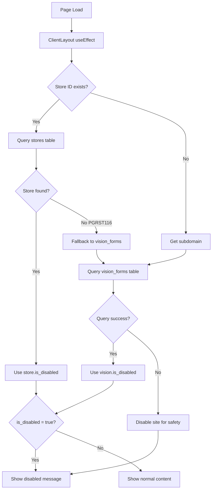

# Site Disabled Functionality Guide

This guide covers the complete implementation of the site disabled functionality that allows administrators to disable storefronts and vision forms based on subscription status or other business rules.

## 📋 Table of Contents

1. [Overview](#overview)
2. [Database Schema](#database-schema)
3. [Implementation Architecture](#implementation-architecture)
4. [ClientLayout Component](#clientlayout-component)
5. [Error Handling & Fallback Logic](#error-handling--fallback-logic)
6. [Environment Configuration](#environment-configuration)
7. [Deployment Considerations](#deployment-considerations)
8. [Troubleshooting](#troubleshooting)
9. [Production Monitoring](#production-monitoring)

## 🎯 Overview

The site disabled functionality provides:
- **Store-Level Disabling**: Disable entire stores via `stores.is_disabled`
- **Vision Form Disabling**: Disable individual vision forms via `vision_forms.is_disabled`
- **Smart Fallback Logic**: Automatic fallback from stores to vision_forms
- **Error Handling**: Graceful handling of database connection issues
- **Production Safety**: Default to disabled when errors occur
- **Comprehensive Logging**: Detailed logging for debugging

## 🗄️ Database Schema

### 1. Stores Table
```sql
CREATE TABLE public.stores (
  id UUID NOT NULL DEFAULT gen_random_uuid(),
  owner_id UUID NULL,
  name TEXT NOT NULL,
  subdomain TEXT NOT NULL,
  template_id UUID NULL,
  branding JSONB NULL,
  created_at TIMESTAMP WITH TIME ZONE NULL DEFAULT timezone('utc'::text, now()),
  stripe_account_id TEXT NULL,
  is_disabled BOOLEAN NULL DEFAULT false,  -- 🔑 KEY FIELD
  description TEXT NULL,
  contact_email TEXT NULL,
  currency TEXT NULL DEFAULT 'GBP'::text,
  timezone TEXT NULL DEFAULT 'gmt'::text,
  language TEXT NULL DEFAULT 'en'::text,
  updated_at TIMESTAMP WITH TIME ZONE NULL DEFAULT timezone('utc'::text, now()),
  CONSTRAINT stores_pkey PRIMARY KEY (id),
  CONSTRAINT stores_subdomain_key UNIQUE (subdomain),
  CONSTRAINT stores_owner_id_fkey FOREIGN KEY (owner_id) REFERENCES profiles (id) ON DELETE CASCADE,
  CONSTRAINT stores_template_id_fkey FOREIGN KEY (template_id) REFERENCES templates (id)
) TABLESPACE pg_default;
```

**Key Fields:**
- `id`: Unique store identifier
- `subdomain`: Store subdomain (e.g., "aura")
- `is_disabled`: Boolean flag to disable the entire store
- `stripe_account_id`: Connected Stripe account
- `currency`: Store currency (default: GBP)

### 2. Vision Forms Table
```sql
CREATE TABLE public.vision_forms (
  id UUID NOT NULL DEFAULT gen_random_uuid(),
  user_id UUID NULL,
  brand_name TEXT NOT NULL,
  website_category TEXT NOT NULL,
  business_category TEXT NOT NULL,
  business_description TEXT NOT NULL,
  website_details TEXT NOT NULL,
  brand_style TEXT NOT NULL,
  logo_url TEXT NULL,
  inspiration_urls TEXT[] NULL,
  social_links JSONB NULL,
  created_at TIMESTAMP WITH TIME ZONE NULL DEFAULT now(),
  order_id TEXT NULL,
  plan_name TEXT NULL,
  status TEXT NULL DEFAULT 'new'::text,
  assigned_to TEXT NULL,
  template_id UUID NULL,
  template_name TEXT NULL,
  eta DATE NULL,
  progress INTEGER NULL DEFAULT 0,
  is_published BOOLEAN NULL DEFAULT false,
  internal_notes TEXT NULL,
  preview_image_url TEXT NULL,
  final_website_url TEXT NULL,
  is_launched BOOLEAN NULL DEFAULT false,
  launched_at TIMESTAMP WITH TIME ZONE NULL,
  subdomain TEXT NULL,
  is_disabled BOOLEAN NULL DEFAULT false,  -- 🔑 KEY FIELD
  CONSTRAINT vision_forms_pkey PRIMARY KEY (id),
  CONSTRAINT vision_forms_order_id_key UNIQUE (order_id),
  CONSTRAINT fk_template FOREIGN KEY (template_id) REFERENCES templates (id) ON DELETE SET NULL,
  CONSTRAINT vision_forms_user_id_fkey FOREIGN KEY (user_id) REFERENCES auth.users (id) ON DELETE CASCADE
) TABLESPACE pg_default;
```

**Key Fields:**
- `id`: Unique vision form identifier
- `subdomain`: Vision form subdomain (e.g., "aura")
- `is_disabled`: Boolean flag to disable the vision form
- `is_launched`: Whether the vision form is launched
- `status`: Current status of the vision form

### 3. Database Indexes
```sql
-- Vision forms indexes
CREATE INDEX IF NOT EXISTS idx_vision_forms_user_id ON public.vision_forms USING btree (user_id);
CREATE INDEX IF NOT EXISTS idx_vision_forms_order_id ON public.vision_forms USING btree (order_id);
CREATE INDEX IF NOT EXISTS idx_vision_forms_plan_name ON public.vision_forms USING btree (plan_name);
CREATE INDEX IF NOT EXISTS idx_vision_forms_is_launched ON public.vision_forms USING btree (is_launched);
CREATE INDEX IF NOT EXISTS idx_vision_forms_subdomain ON public.vision_forms USING btree (subdomain);
CREATE INDEX IF NOT EXISTS idx_vision_forms_is_disabled ON public.vision_forms USING btree (is_disabled);

-- Stores indexes
CREATE INDEX IF NOT EXISTS idx_stores_subdomain ON public.stores USING btree (subdomain);
CREATE INDEX IF NOT EXISTS idx_stores_is_disabled ON public.stores USING btree (is_disabled);
```

## 🏗️ Implementation Architecture

### 1. Component Hierarchy
```
RootLayout
├── StoreProvider
├── CustomerAuthProvider
├── CartProvider
├── Header
├── ClientLayout (🔑 DISABLED CHECK HAPPENS HERE)
│   └── {children} (All page content)
└── Footer
```

### 2. Disabled State Flow


## 🎨 ClientLayout Component

### File: `app/ClientLayout.tsx`

**Purpose**: Central component that checks disabled status and conditionally renders content.

**Key Features**:
- Environment-based store ID checking
- Subdomain extraction and validation
- Smart fallback logic
- Comprehensive error handling
- Production-safe defaults

### Implementation Details

```typescript
"use client";
import { useEffect, useState } from "react";
import { supabase } from "../lib/supabase";

function getSubdomain() {
  if (typeof window === 'undefined') return null;
  const host = window.location.host;
  const parts = host.split('.');
  console.log('[ClientLayout] getSubdomain - host:', host, 'parts:', parts);
  if (parts.length > 2) return parts[0];
  return null;
}

export default function ClientLayout({ children }: { children: React.ReactNode }) {
  const [disabled, setDisabled] = useState(false);
  const [loading, setLoading] = useState(true);

  useEffect(() => {
    async function checkDisabled() {
      try {
        const storeId = process.env.NEXT_PUBLIC_STORE_ID;
        console.log('[ClientLayout] Checking disabled status, storeId:', storeId);
        
        if (storeId) {
          // Try to find store first
          const { data: store, error: storeError } = await supabase
            .from('stores')
            .select('is_disabled')
            .eq('id', storeId)
            .single();
          
          console.log('[ClientLayout] Store query result:', { store, storeError });
          
          if (storeError) {
            console.error('[ClientLayout] Error fetching store disabled status:', storeError);
            
            // Smart fallback: If store not found, try vision_forms
            if (storeError.code === 'PGRST116') {
              console.log('[ClientLayout] Store not found, falling back to vision_forms check');
              const subdomain = getSubdomain();
              if (subdomain) {
                const { data: vision, error: visionError } = await supabase
                  .from('vision_forms')
                  .select('is_disabled')
                  .eq('subdomain', subdomain)
                  .single();
                
                console.log('[ClientLayout] Vision query result:', { vision, visionError });
                
                if (visionError) {
                  console.error('[ClientLayout] Error fetching vision disabled status:', visionError);
                  setDisabled(true); // Safety fallback
                } else {
                  setDisabled(!!vision?.is_disabled);
                  console.log('[ClientLayout] Vision disabled status:', !!vision?.is_disabled);
                }
              } else {
                console.log('[ClientLayout] No subdomain found, keeping site enabled');
                setDisabled(false);
              }
            } else {
              // For other errors, disable for safety
              setDisabled(true);
            }
          } else {
            setDisabled(!!store?.is_disabled);
            console.log('[ClientLayout] Store disabled status:', !!store?.is_disabled);
          }
          setLoading(false);
          return;
        }
        
        // No store ID, check subdomain directly
        const subdomain = getSubdomain();
        console.log('[ClientLayout] No storeId, checking subdomain:', subdomain);
        
        if (subdomain) {
          const { data: vision, error: visionError } = await supabase
            .from('vision_forms')
            .select('is_disabled')
            .eq('subdomain', subdomain)
            .single();
          
          console.log('[ClientLayout] Vision query result:', { vision, visionError });
          
          if (visionError) {
            console.error('[ClientLayout] Error fetching vision disabled status:', visionError);
            setDisabled(true);
          } else {
            setDisabled(!!vision?.is_disabled);
            console.log('[ClientLayout] Vision disabled status:', !!vision?.is_disabled);
          }
        } else {
          console.log('[ClientLayout] No subdomain found, keeping site enabled');
        }
        setLoading(false);
      } catch (error) {
        console.error('[ClientLayout] Unexpected error in checkDisabled:', error);
        setDisabled(true); // Safety fallback
        setLoading(false);
      }
    }
    checkDisabled();
  }, []);

  if (loading) return null;
  
  if (disabled) {
    return (
      <div className="min-h-screen flex items-center justify-center bg-gray-100">
        <div className="bg-white p-8 rounded-xl shadow text-center max-w-md mx-auto">
          <h1 className="text-3xl font-bold mb-4 text-red-600">Site Temporarily Disabled</h1>
          <p className="text-gray-700 mb-4">
            This site is currently disabled due to an inactive or expired subscription.<br />
            Please contact the site owner or renew your subscription to regain access.
          </p>
        </div>
      </div>
    );
  }

  return <>{children}</>;
}
```

## 🔄 Error Handling & Fallback Logic

### 1. Error Types and Handling

| Error Code | Description | Handling Strategy |
|------------|-------------|-------------------|
| `PGRST116` | No rows returned (store not found) | Fallback to vision_forms check |
| `PGRST301` | Multiple rows returned | Disable site for safety |
| `PGRST116` | Vision form not found | Keep site enabled |
| Network Error | Connection issues | Disable site for safety |
| Auth Error | Authentication issues | Disable site for safety |

### 2. Fallback Logic Flow

```typescript
// 1. Try stores table first (if NEXT_PUBLIC_STORE_ID exists)
if (storeId) {
  const { data: store, error: storeError } = await supabase
    .from('stores')
    .select('is_disabled')
    .eq('id', storeId)
    .single();
  
  // 2. If store not found, fallback to vision_forms
  if (storeError?.code === 'PGRST116') {
    const subdomain = getSubdomain();
    if (subdomain) {
      const { data: vision } = await supabase
        .from('vision_forms')
        .select('is_disabled')
        .eq('subdomain', subdomain)
        .single();
      
      setDisabled(!!vision?.is_disabled);
    }
  }
}

// 3. If no store ID, check vision_forms directly
else {
  const subdomain = getSubdomain();
  if (subdomain) {
    const { data: vision } = await supabase
      .from('vision_forms')
      .select('is_disabled')
      .eq('subdomain', subdomain)
      .single();
    
    setDisabled(!!vision?.is_disabled);
  }
}
```

### 3. Safety Mechanisms

- **Default to Disabled**: When errors occur, site is disabled for safety
- **Comprehensive Logging**: All operations are logged for debugging
- **Graceful Degradation**: Handles missing data gracefully
- **Production Safety**: Conservative approach in production environments

## ⚙️ Environment Configuration

### 1. Required Environment Variables

```env
# Supabase Configuration
NEXT_PUBLIC_SUPABASE_URL=your_supabase_url
NEXT_PUBLIC_SUPABASE_ANON_KEY=your_supabase_anon_key
SUPABASE_SERVICE_ROLE_KEY=your_service_role_key

# Store Configuration (Optional)
NEXT_PUBLIC_STORE_ID=7a92d0ab-4311-478b-9bf4-cd8c194fc07c

# Site Configuration
NEXT_PUBLIC_SITE_URL=https://aura.pixeocommerce.com
```

### 2. Environment-Specific Behavior

| Environment | Store ID | Behavior |
|-------------|----------|----------|
| **Development** | Set | Checks stores table first, fallback to vision_forms |
| **Production** | Not Set | Checks vision_forms table directly |
| **Production** | Set (Invalid) | Falls back to vision_forms check |

### 3. Subdomain Detection

```typescript
function getSubdomain() {
  if (typeof window === 'undefined') return null;
  const host = window.location.host;
  const parts = host.split('.');
  
  // Examples:
  // "aura.pixeocommerce.com" -> ["aura", "pixeocommerce", "com"] -> "aura"
  // "localhost:3000" -> ["localhost:3000"] -> null
  // "subdomain.example.com" -> ["subdomain", "example", "com"] -> "subdomain"
  
  if (parts.length > 2) return parts[0];
  return null;
}
```

## 🚀 Deployment Considerations

### 1. Production Checklist

- [ ] Verify Supabase connection in production
- [ ] Check environment variables are set correctly
- [ ] Test disabled state functionality
- [ ] Verify subdomain detection works
- [ ] Check console logs for errors
- [ ] Test fallback logic

### 2. Database Setup

```sql
-- Ensure proper indexes exist
CREATE INDEX IF NOT EXISTS idx_stores_is_disabled ON stores(is_disabled);
CREATE INDEX IF NOT EXISTS idx_vision_forms_is_disabled ON vision_forms(is_disabled);
CREATE INDEX IF NOT EXISTS idx_vision_forms_subdomain ON vision_forms(subdomain);

-- Test queries
SELECT * FROM stores WHERE is_disabled = true;
SELECT * FROM vision_forms WHERE subdomain = 'aura' AND is_disabled = true;
```

### 3. Monitoring Setup

```typescript
// Add to ClientLayout for monitoring
console.log('[ClientLayout] Environment check:', {
  storeId: process.env.NEXT_PUBLIC_STORE_ID,
  host: typeof window !== 'undefined' ? window.location.host : 'server',
  supabaseUrl: process.env.NEXT_PUBLIC_SUPABASE_URL
});
```

## 🔍 Troubleshooting

### 1. Common Issues

#### Issue: Site Always Disabled in Production
**Symptoms**: Site shows disabled message even when `is_disabled = false`
**Causes**:
- Store ID doesn't exist in database
- Supabase connection issues
- RLS policy blocking queries

**Solutions**:
```sql
-- Check if store exists
SELECT * FROM stores WHERE id = 'your-store-id';

-- Check vision_forms
SELECT * FROM vision_forms WHERE subdomain = 'aura';

-- Check RLS policies
SELECT * FROM pg_policies WHERE tablename = 'stores';
```

#### Issue: Site Not Disabling When Expected
**Symptoms**: Site remains enabled when `is_disabled = true`
**Causes**:
- ClientLayout not loading
- JavaScript errors
- Caching issues

**Solutions**:
- Check browser console for errors
- Clear browser cache
- Verify ClientLayout is in layout hierarchy

#### Issue: Subdomain Not Detected
**Symptoms**: Fallback to vision_forms not working
**Causes**:
- Incorrect domain structure
- Client-side rendering issues

**Solutions**:
```typescript
// Debug subdomain detection
console.log('Host:', window.location.host);
console.log('Parts:', window.location.host.split('.'));
console.log('Subdomain:', getSubdomain());
```

### 2. Debug Queries

```sql
-- Check stores table
SELECT id, name, subdomain, is_disabled, created_at 
FROM stores 
ORDER BY created_at DESC;

-- Check vision_forms table
SELECT id, brand_name, subdomain, is_disabled, is_launched, status 
FROM vision_forms 
WHERE subdomain IS NOT NULL 
ORDER BY created_at DESC;

-- Check disabled records
SELECT 'stores' as table_name, id, name as identifier, is_disabled 
FROM stores WHERE is_disabled = true
UNION ALL
SELECT 'vision_forms' as table_name, id, brand_name as identifier, is_disabled 
FROM vision_forms WHERE is_disabled = true;
```

### 3. Console Log Analysis

**Successful Store Check**:
```
[ClientLayout] Checking disabled status, storeId: 7a92d0ab-4311-478b-9bf4-cd8c194fc07c
[ClientLayout] Store query result: { store: { is_disabled: false }, storeError: null }
[ClientLayout] Store disabled status: false
```

**Successful Fallback**:
```
[ClientLayout] Checking disabled status, storeId: 7a92d0ab-4311-478b-9bf4-cd8c194fc07c
[ClientLayout] Store query result: { store: null, storeError: { code: 'PGRST116', ... } }
[ClientLayout] Store not found, falling back to vision_forms check
[ClientLayout] getSubdomain - host: aura.pixeocommerce.com parts: ["aura", "pixeocommerce", "com"]
[ClientLayout] Vision query result: { vision: { is_disabled: false }, visionError: null }
[ClientLayout] Vision disabled status: false
```

**Error Case**:
```
[ClientLayout] Error fetching store disabled status: { code: 'PGRST116', ... }
[ClientLayout] Store not found, falling back to vision_forms check
[ClientLayout] Error fetching vision disabled status: { code: 'PGRST116', ... }
```

## 📊 Production Monitoring

### 1. Key Metrics to Monitor

- **Disabled State Accuracy**: Ensure disabled state matches database
- **Fallback Success Rate**: Monitor fallback logic usage
- **Error Rates**: Track Supabase query failures
- **Response Times**: Monitor disabled check performance

### 2. Alerting Setup

```typescript
// Add to ClientLayout for monitoring
if (storeError && storeError.code !== 'PGRST116') {
  // Send alert for unexpected errors
  console.error('[ALERT] Unexpected store query error:', storeError);
}

if (visionError && visionError.code !== 'PGRST116') {
  // Send alert for unexpected errors
  console.error('[ALERT] Unexpected vision query error:', visionError);
}
```

### 3. Health Check Endpoint

```typescript
// Add to API routes
export async function GET() {
  try {
    const { data: stores } = await supabase
      .from('stores')
      .select('id, is_disabled')
      .limit(1);
    
    const { data: visions } = await supabase
      .from('vision_forms')
      .select('id, is_disabled')
      .limit(1);
    
    return NextResponse.json({
      status: 'healthy',
      stores_accessible: !!stores,
      vision_forms_accessible: !!visions
    });
  } catch (error) {
    return NextResponse.json({
      status: 'unhealthy',
      error: error.message
    }, { status: 500 });
  }
}
```

## 📚 Related Files

- `app/ClientLayout.tsx` - Main disabled state logic
- `app/layout.tsx` - Layout hierarchy
- `lib/supabase.ts` - Supabase client configuration
- `contexts/StoreContext.tsx` - Store data management
- `database-schema.sql` - Database schema
- `fix-rls-policies.sql` - Security policies

## 🔧 Maintenance

### Regular Tasks

1. **Monitor Error Logs**: Check for unexpected errors in production
2. **Verify Database Health**: Ensure tables and indexes are optimized
3. **Test Disabled States**: Regularly test both enabled and disabled states
4. **Update Documentation**: Keep this guide updated with any changes

### Performance Optimization

```sql
-- Monitor query performance
EXPLAIN ANALYZE SELECT is_disabled FROM stores WHERE id = 'store-id';
EXPLAIN ANALYZE SELECT is_disabled FROM vision_forms WHERE subdomain = 'aura';

-- Add additional indexes if needed
CREATE INDEX CONCURRENTLY IF NOT EXISTS idx_stores_id_is_disabled ON stores(id, is_disabled);
CREATE INDEX CONCURRENTLY IF NOT EXISTS idx_vision_forms_subdomain_is_disabled ON vision_forms(subdomain, is_disabled);
```
